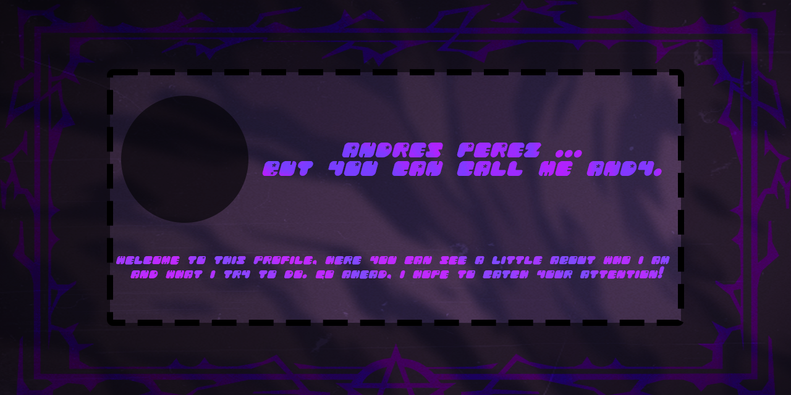

<h1 align="center"> Hi, nice to meet you I'm Andrés Pérez </h1>

<!--Profile Count Badge-->

  

<!--Banner-->

<!--About me-->  

#  About me 
*Computer systems engineer (Tester QA / Technical support)*
               

Hello good morning.
I am a young man who recently graduated looking for a job opportunity. I have some experience in automation with the help of selenium and maintenance of computer equipment, I still lack work experience. 

- ✨ Student for life
- 🌱 I’m currently learning many things, everyday is a learning opportunity.
- 🤓 Intern at **Fusion T and a1qa**.
- 🎙️ Languages: **Spanish and English**.

<!--Skills-->

#  Skills And Tᴏᴏʟs

<!--Skills Icons-->

 

<!--Stats-->

#  Stats

<table width="100%">
  <tr>
    <td width="50%">
      <h3 align="center"><strong>Gɪᴛʜᴜʙ Sᴛᴀᴛs</strong></h3>
      

        
      

    </td>
    <td width="50%">
      <h3 align="center"><strong>Sᴛʀᴇᴀᴋ Sᴛᴀᴛs</strong></h3>
      

        
      

    </td>
  </tr>
  <tr>
    <td width="50%">
      <h3 align="center"><strong>Lᴀᴛᴇsᴛ Pʀᴏᴊᴇᴄᴛ</strong></h3>
      

        
      

    </td>
    <td width="50%">
      <h3 align="center"><strong>Cᴏɴᴛʀɪʙᴜᴛɪᴏɴ Gʀᴀᴘʜ</strong></h3>
      

        <a href="https://github.com/SysAndresPerez/">
          

                
        

        </a>
      

    </td>
  </tr>
</table>
 

  <a href="https://github.com/SysAndresPerez/">
  

 

<!--Contact with me--> 

#  Contact With Me

Don't hesitate to contact me if you have any questions, suggestions or are interested!

 <a href="https://www.linkedin.com/in/sysandresperez/" target="_blank">

<!--Footer--> 

  

